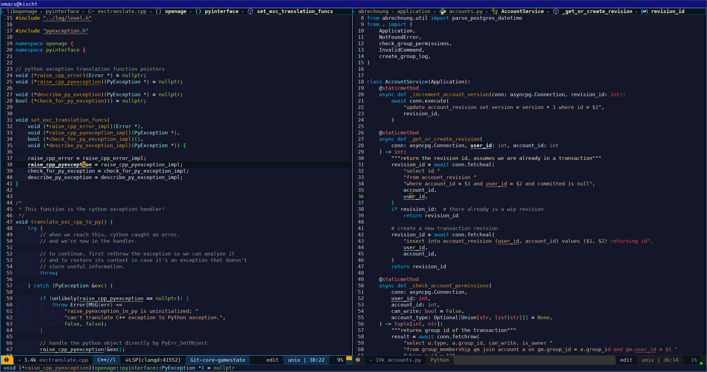

# Starlit Theme for Emacs

[](http://www.gnu.org/licenses/gpl-3.0.txt)
[](http://melpa.org/#/starlit-theme)
[](http://stable.melpa.org/#/starlit-theme)


## What?

Starlit customizes your Emacs to be deep blue with bright colors from a starlit sky.


[](assets/screenshot_cpp_py.png)


## Installation

### Spacemacs

Spacemacs automatically uses and installs `starlit` when you add it to the theme list:

```lisp
;; within your dotspacemacs/init function, set:
dotspacemacs-themes '(starlit
                      ...other themes)
```

### Package.el

Starlit is available in [MELPA](http://melpa.org) and [MELPA stable](https://stable.melpa.org).

To install it:

```
M-x package-install starlit-theme
```

To load the theme on Emacs startup:

```lisp
(load-theme 'starlit t)
```

### Manual

Clone https://github.com/SFTtech/starlit-emacs for example to `~/.emacs.d/themes/starlit-emacs`.
This path then needs to be loaded within your emacs config:

```elisp
(add-to-list 'custom-theme-load-path "~/.emacs.d/themes/starlit-emacs")
```

Alternatively, this snippet discovers all theme directories in `~/.emacs.d/themes/`:

```elisp
(let ((basedir (locate-user-emacs-file "themes/")))
  (when (file-directory-p basedir)
    (dolist (f (directory-files basedir))
      (if (and (not (or (equal f ".") (equal f "..")))
               (file-directory-p (concat basedir f)))
          (add-to-list 'custom-theme-load-path (concat basedir f))))))
```

To load the theme, call `load-theme` interactively:

`M-x load-theme RET starlit`


## Customization

### Custom colors

You can change theme base colors by overriding values by customizing `starlit-custom-colors`.
The base colors are defined in `starlit-default-colors` in `starlit-theme.el`.

Of course you can customize any other color too, or create a derived theme :)

Example to override theme base colors in your config instead of `customize`:

```elisp
(setq starlit-custom-colors
      '(("current-line" . "#101114")
        ("background"   . "#091422")))
(load-theme 'starlit t)
```


### Header scaling

You can toggle if headings have a larger font size than normal text.
To configure this, customize `starlit-scale-headlines`.
This change has to be applied before loading the theme.

To disable the header scaling outside of `customize`:
```elisp
;; disable headline scaling
(setq starlit-scale-headlines nil)
```


## FAQ

### Does it work with terminal Emacs?

Yes it should look okay if your terminal supports at least 256 colors,
although 32-bit color mode is needed to display all colors like intended.

The theme was tested successfully using the `kitty` terminal emulator.


### Something looks ugly

Since not all emacs modes could be tested and customized, some faces may still look ugly.
Please [report or fix them](#contact).


## Contributors

Everyone who contributed is likely listed [here](https://github.com/SFTtech/starlit-emacs/contributors).


## Contact

If you have questions, suggestions, encounter any problem,
please join our [Matrix](https://matrix.org) channel and ask!

```
#sfttech:matrix.org
```

In case you didn't know anyway, you can report [issues](https://github.com/SFTtech/starlit-emacs/issues) or - even better - submit [pull requests](https://github.com/SFTtech/starlit-emacs/pulls).


## License

This theme is distributed under the GNU General Public License, version 3 or later.
See the [LICENSE](LICENSE) and [COPYING](COPYING) notice.
